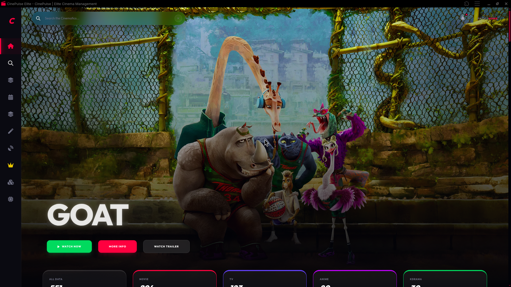
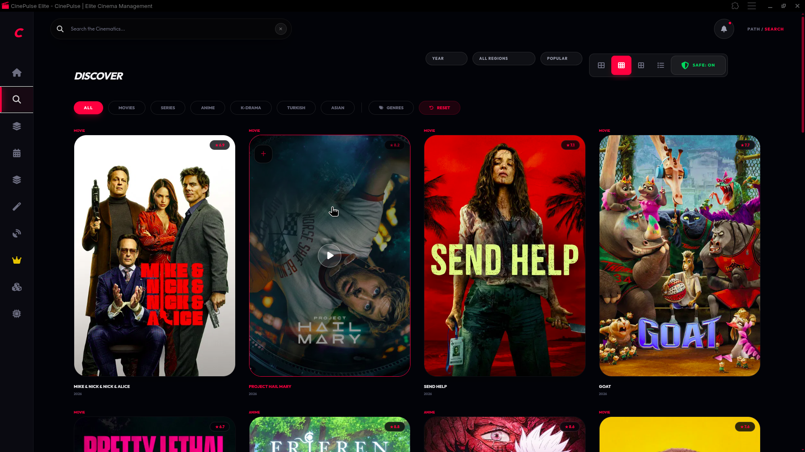

<p align="center">
  
</p>

<h1 align="center">CinePulse Elite</h1>

<p align="center">
  <strong>The Ultimate Privacy-First Cinematic Management Engine.</strong>
</p>

<p align="center">
  
  
  
  
</p>

---

## 🎬 Overview

CinePulse is not just another movie tracker. It is a high-performance, single-page cinematic hub designed for enthusiasts who demand **privacy**, **speed**, and **advanced features**. Built with pure Vanilla JavaScript and styled with an elite dark-mode aesthetic, CinePulse operates entirely on the client side, ensuring your data never leaves your device—unless you choose to sync it via our secure P2P engine.

### ✨ Key Highlighs
- 🚀 **Zero Backend**: Runs entirely in the browser using `localStorage`.
- 🧠 **Neural Link**: Peer-to-peer synchronization across devices.
- 🌌 **Saga Matrix**: Forge and track complex cinematic universes.
- 🎨 **Elite UI**: Fluid animations, glassmorphism, and responsive design.

---

## 📸 Visual Journey

### 🏠 Home Experience
The central hub for your cinematic universe. Dynamic counters, "Continue Watching" progress, and trending discovery at a glance.

<p align="center">
  
  <br>
  <em>Elite Hero Slider & Quick Actions</em>
</p>

<p align="center">
  
  <br>
  <em>Real-time Statistics & Resume Playback</em>
</p>

<p align="center">
  
  <br>
  <em>Curated Trending Rows</em>
</p>

---

### 🔍 Discovery & Logic
Find exactly what you want with our advanced discovery engine. Filter by year, region, popularity, or dive into specific genres.

<p align="center">
  
</p>

---

### 📚 Personal Archive (My List)
Manage your growing collection with elite-tier organization. Multi-select, advanced search, and timeline versioning.

<p align="center">
  
</p>

---

### 🧬 Neural Link (P2P Sync)
Synchronize your library across multiple devices without ever using a central server. Multi-master P2P technology ensures your data is always with you.

<p align="center">
  
</p>

---

### 🌌 Saga Matrix
Master the complexities of your favorite trilogies and cinematic universes. Forge your own timelines or discover existing ones.

<p align="center">
  
</p>

---

### 👑 Masterpieces
Celebrate the best of the best. A dedicated space for "Crowned" titles and perfect 5-star rankings.

<p align="center">
  
</p>

---

### 🧪 Rhythm Lab & For You
Automated recommendations and random pickers for when you just can't decide.

<p align="center">
  
  
</p>

---

### 🛠 Tech Stack

| Component | Technology |
| --- | --- |
| **Logic** | Vanilla JavaScript (ES6+) |
| **Styling** | TailwindCSS, FontAwesome |
| **P2P Engine** | PeerJS |
| **Storage** | Browser LocalStorage |
| **API** | TMDB (The Movie Database) |
| **PWA** | Service Workers & Manifest |

---

## 🚀 Getting Started

CinePulse is a "No-Build" project. You can run it instantly:

1. **Clone the Repo**
   ```bash
   git clone https://github.com/your-username/cinepulse.git
   ```
2. **Open index.html**
   - Simply open `index.html` in any modern browser.
   - For PWA features, it is recommended to serve it via a local server (like **Live Server** in VS Code).

---

## 🤝 Community

Contributions are what make the open-source community such an amazing place to learn, inspire, and create. Any contributions you make are **greatly appreciated**.

Check out our [CONTRIBUTING.md](docs/CONTRIBUTING.md) to get started!

---

## 📜 License

Distributed under the MIT License. See [LICENSE](docs/LICENSE) for more information.

---

<p align="center">
  Built with ❤️ by the @abeldevs1
</p>
